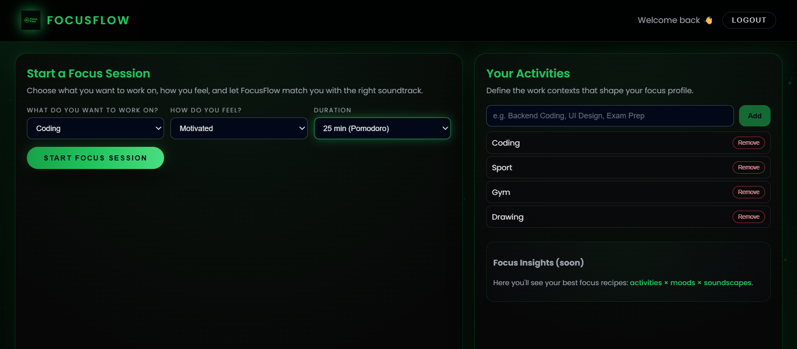
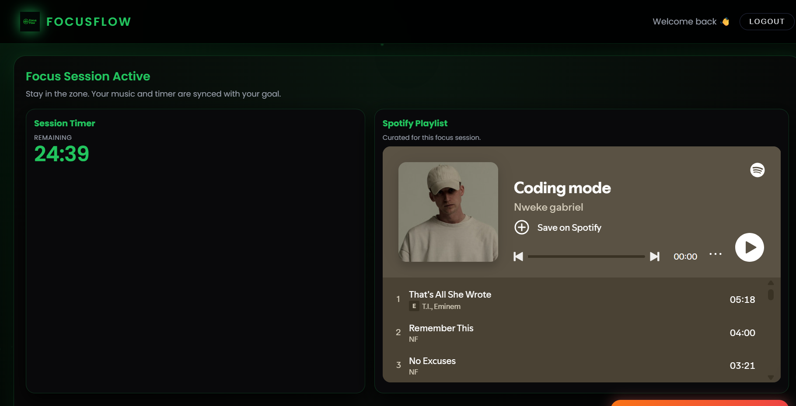
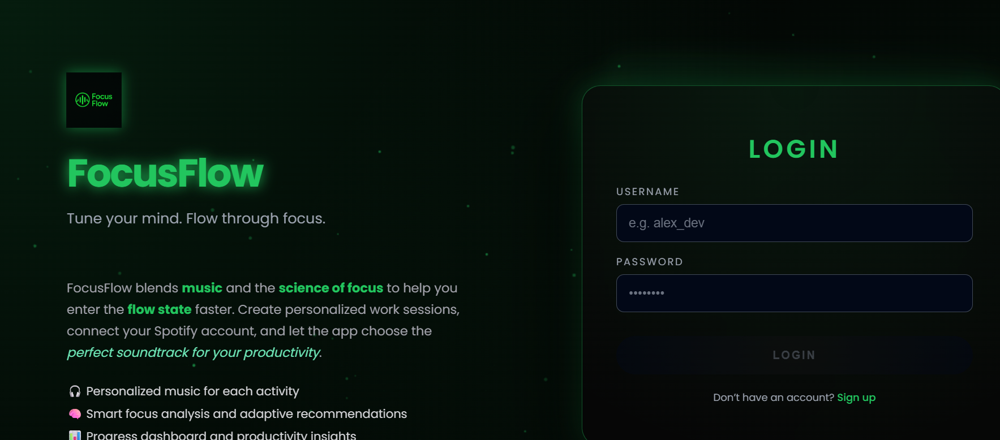

# 🎵 FocusFlow

**FocusFlow** is a Full-Stack productivity application that combines focus techniques with the power of music. The app generates adaptive Spotify playlists based on your current activity and mood, helping you get into the "flow" state faster.

## ✨ Key Features

* **🎧 Smart Spotify Integration:** Connect via OAuth2 to generate and play personalized playlists (e.g., "Coding + Motivated" or "Reading + Relaxed").
* **⏱️ Focus Sessions:** Integrated timer for work sessions (Pomodoro or custom duration).
* **📊 Custom Activities:** Users can define their own work contexts (Coding, Workout, Design, etc.).
* **🔐 Secure Authentication:** Complete Login/Register system using **JWT (JSON Web Tokens)** and .NET Identity.

## 📸 Application Overview (Screenshots)

### 1. Dashboard & Session Configuration
Here the user selects the activity, mood, and session duration.


### 2. Active Session (Focus Mode)
Minimalist interface with timer and automatically generated Spotify playlist.


### 3. Authentication & Design
Modern interface with visual effects (particles) and responsive design.


---

## 🛠️ Tech Stack

### Backend (.NET 8)
* **ASP.NET Core Web API:** Robust RESTful architecture.
* **Entity Framework Core:** ORM for interaction with SQL Server database.
* **Identity:** User and role management.
* **JWT Bearer Authentication:** Endpoint security.
* **Spotify Web API:** Server-side integration for search and playback.

### Frontend (Angular 19)
* **Angular CLI & Standalone Components:** Latest version of Angular.
* **RxJS:** Handling asynchronous states and HTTP requests.
* **SCSS:** Modular styles and advanced CSS animations.
* **Interceptors:** Automatic attachment of JWT tokens.

---

## 🚀 How to Run Locally

### Prerequisites
* Node.js (v18+)
* .NET 8 SDK
* SQL Server (LocalDB or Docker)
* A Spotify Developer account (for Client ID/Secret)

### 1. Backend Setup
1.  Navigate to the API folder:
    ```bash
    cd FocusFlow.Api
    ```
2.  Configure `appsettings.json` (or use User Secrets for safety):
    ```json
    "ConnectionStrings": {
      "DefaultConnection": "Server=(localdb)\\mssqllocaldb;Database=FocusFlowDb;..."
    },
    "Spotify": {
      "ClientId": "YOUR_SPOTIFY_CLIENT_ID",
      "ClientSecret": "YOUR_SPOTIFY_CLIENT_SECRET",
      "RedirectUri": "http://localhost:4200/profile" 
    }
    ```
3.  Apply database migrations:
    ```bash
    dotnet ef database update
    ```
4.  Start the server:
    ```bash
    dotnet run
    ```

### 2. Frontend Setup
1.  Navigate to the client folder:
    ```bash
    cd focusflow-client
    ```
2.  Install dependencies:
    ```bash
    npm install
    ```
3.  Start the application:
    ```bash
    ng serve
    ```
4.  Access `http://localhost:4200` in your browser.

---

## 🔮 Roadmap
* [ ] Complete session history and productivity charts.
* [ ] Integration with Spotify Web Playback SDK for direct browser control (no iframe).
* [ ] "Dark/Light Theme" toggle.

---
